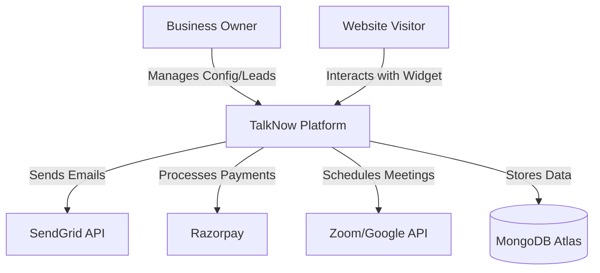
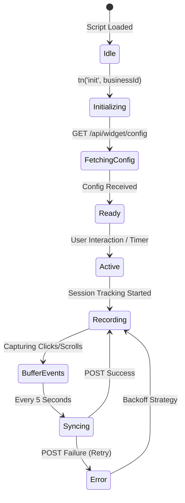

# Architecture Document - TalkNow

## 1. System Overview
TalkNow is a distributed multi-tenant SaaS application. It follows a decoupled architecture where the **Backend API** acts as the central coordinator, the **Frontend Dashboard** as the management interface, and the **Widget** as the high-performance client-side agent.

## 2. C4 Model - System Context


## 3. Container Diagram (The Internal Tech Stack)
```mermaid
subgraph "TalkNow Platform"
    subgraph "Client Tier"
        W[Embeddable Widget - React/Vite]
        D[Dashboard SPA - React/MUI v6]
    end

    subgraph "API Tier"
        B[Node.js Express Server]
        S[Socket.io Server]
    end

    subgraph "Data Tier"
        M[(MongoDB)]
        R[(Redis - Optional for Caching)]
    end

    W <-->|Socket.io| S
    D <-->|REST API| B
    B <--> M
    S <--> M
    W <-->|REST API| B
end
```

## 4. Infrastructure & Networking
TalkNow is designed for containerized deployment using Docker. In a production environment, the following networking layout is recommended:

-   **Reverse Proxy (Nginx/Traefik):** Handles SSL termination and routes traffic to the appropriate service.
    -   `/api/*` -> Backend API
    -   `/socket.io/*` -> Socket.io Server
    -   `/widget/*` -> Static Widget Assets
    -   `/*` -> Frontend Dashboard SPA
-   **Docker Networking:** Services communicate over a private bridge network.
-   **Security:** The Database (MongoDB) is placed in a private subnet, accessible only by the Backend container.

## 5. Widget Lifecycle & State Machine
The widget is designed to be highly resilient. It follows a specific initialization sequence to ensure it doesn't block the host website's main thread.



## 6. Implementation Patterns

### 6.1 Event Batching (The Tracker)
To minimize network overhead, the tracker uses a **Buffered Queue** approach:
1.  **Intercept:** Listen for `click`, `scroll`, and `mousemove` (throttled).
2.  **Queue:** Append event to an in-memory array with a high-resolution timestamp.
3.  **Flush:** Every 5000ms, if the queue is not empty, deep clone the array and send it to the API.
4.  **Clear:** On successful API response, clear the buffer.

### 6.2 Socket Room Strategy
Real-time isolation is maintained through a strict room naming convention:
-   **Business Room:** `business_{businessId}` (Used for system-wide broadcasts).
-   **Visitor Room:** `visitor_{businessId}_{visitorId}` (Used for private 1-on-1 chat).
-   **Agent Room:** `agent_{businessId}` (Used for notifying all agents of a new lead).

## 7. Data Consistency & Reliability
-   **Mongoose Middleware:** Automatically updates timestamps and implements soft-deletes for leads.
-   **Transaction Support:** Crucial operations (like payment processing and subscription upgrades) use MongoDB transactions to prevent partial state updates.
-   **Graceful Degradation:** If the backend is unreachable, the widget hides interaction modules and falls back to a simple "Contact Form" that retries submission later.
