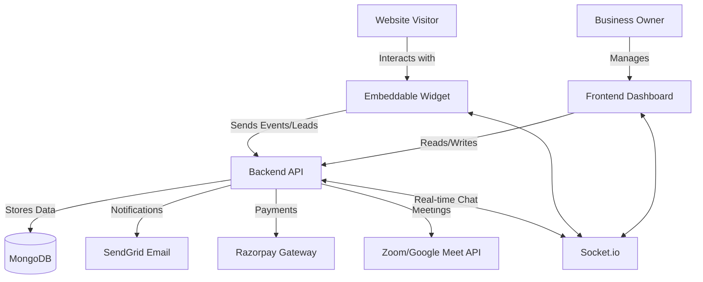
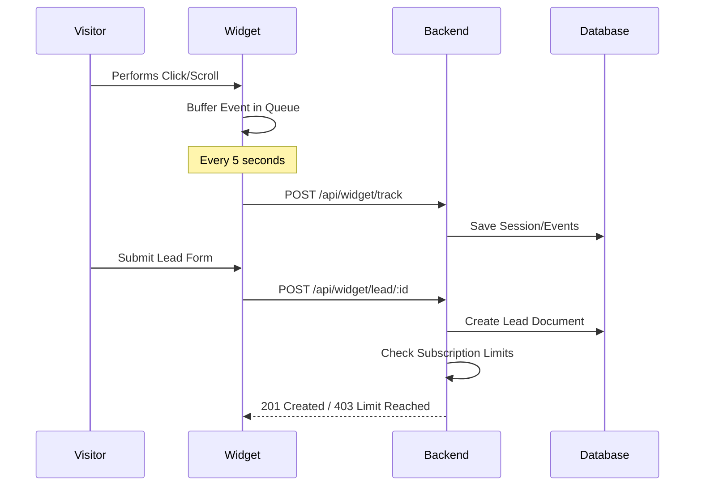

# Architecture Document - TalkNow

## 1. System Overview
TalkNow is built using a modern MERN-like stack (MongoDB, Express, React, Node.js) with TypeScript throughout. The system is split into three main components:
1.  **Backend API:** Handles data persistence, authentication, and external integrations.
2.  **Frontend Dashboard:** A React-based SPA for business owners to manage their widget and leads.
3.  **Embeddable Widget:** A lightweight React application bundled into an IIFE script for client websites.

## 2. High-Level Architecture

## 3. Technology Stack
- **Language:** TypeScript (Strict Mode)
- **Frontend/Widget:** React 19, Material UI (MUI) v6, Vite
- **Backend:** Node.js, Express
- **Database:** MongoDB (via Mongoose ODM)
- **Real-time:** Socket.io
- **Styling:** Emotion (MUI default), Shadow DOM (for widget)
- **Deployment:** Docker, Docker Compose

## 4. Component Breakdown

### 4.1 Backend (Node.js/Express)
The backend follows a standard Controller-Route-Model pattern.
- **Controllers:** Logic for handling requests.
- **Routes:** Endpoint definitions and middleware application (auth, validation).
- **Models:** Mongoose schemas defining the data structure.
- **Services:** External API integrations (Meeting services, Email).

### 4.2 Frontend (React SPA)
The dashboard is built for responsiveness and administrative efficiency.
- **Protected Routes:** RBAC implementation to separate Admin and Business Owner views.
- **Context API:** Global state management for authentication and theme settings.
- **MUI v6:** Utilizes the latest Material UI components and Grid2 for layouts.

### 4.3 Widget (React IIFE)
A specialized build that allows the entire React app to be injected into a single `<script>` tag.
- **Shadow DOM:** Used to encapsulate styles so they don't bleed into or from the host website.
- **Event Tracker:** Batches visitor interactions (clicks, scrolls) and pushes them to the backend every 5 seconds.

## 5. Data Flow (Lead Tracking)

## 6. Security
- **Authentication:** JWT-based stateless authentication.
- **Validation:** Input validation using Zod schemas on the backend.
- **CORS:** Restrictive CORS policies to allow widget communication only from registered domains.
- **RBAC:** Roles: `admin`, `business_owner`, `agent`.

## 7. Scalability & Performance
- **Asynchronous Processing:** Non-critical tasks (like sending emails) are handled without blocking the main request loop.
- **Event Batching:** Reduces the number of HTTP requests from the widget to the backend.
- **Database Indexing:** Optimized MongoDB indexes for fast retrieval of leads and session data.
